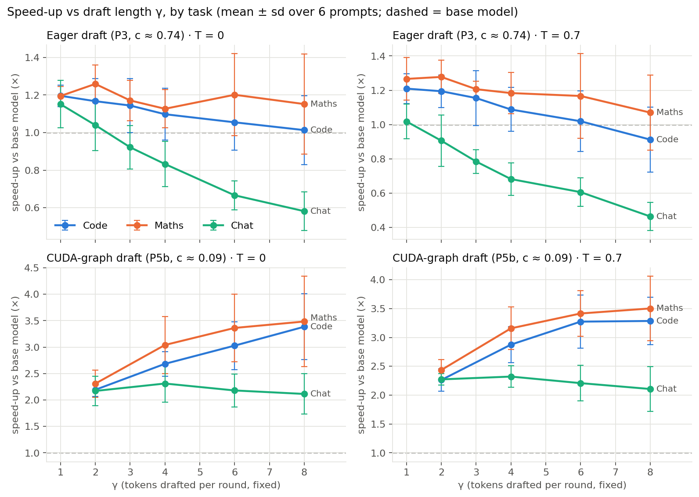
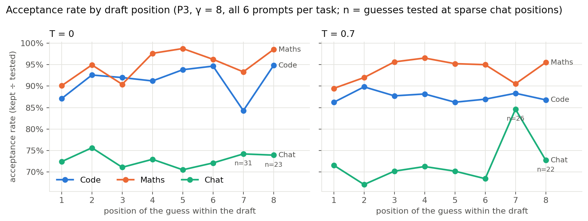
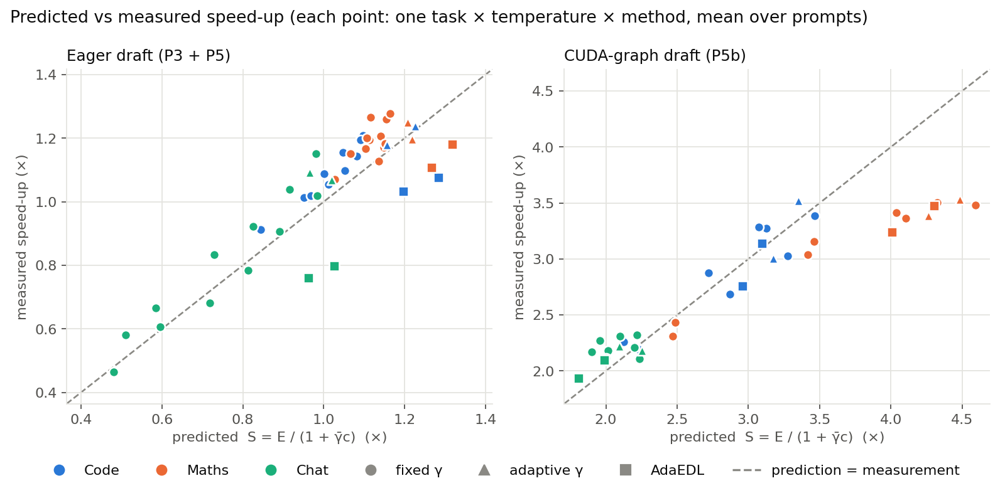
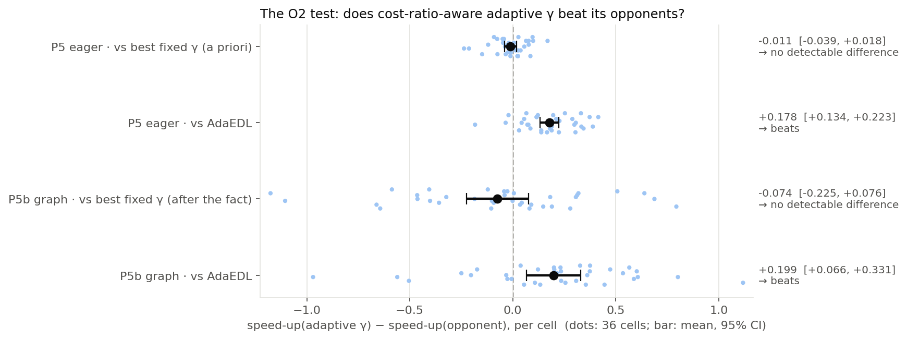
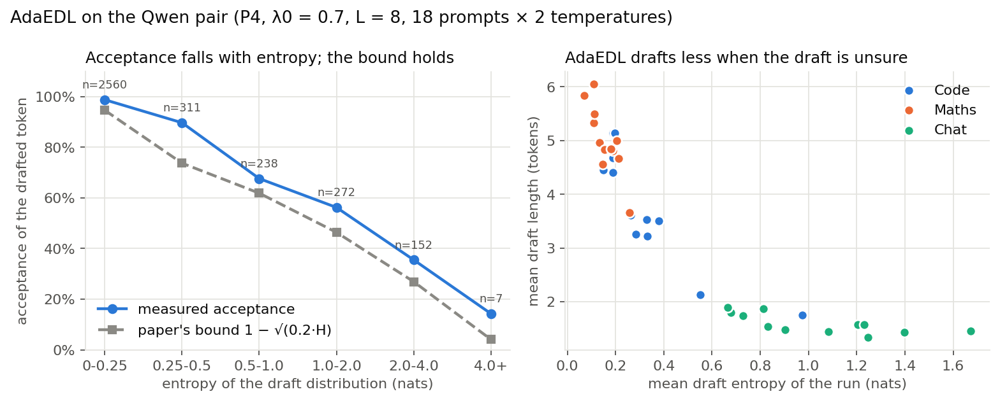

# Speculative Decoding on a Laptop GPU: Lossless Speed-up, and When Adaptive Draft Length Pays Off

BAI506 mini project · Qwen2.5-0.5B-Instruct (draft) + Qwen2.5-3B-Instruct (target) · batch size 1

## Abstract

We implemented lossless speculative decoding (Leviathan et al., 2023; Chen et al., 2023) in PyTorch: a 0.5B draft model proposes γ tokens, and the 3B target verifies them in one forward pass with modified rejection sampling.

- **Speed:** on an RTX 4060 Laptop GPU in fp16, the engine is 1.20× faster on code, 1.26–1.28× on maths and 1.02–1.15× on chat. These are the best fixed γ in Phase 3.
- **Correctness:** greedy output is token-for-token identical to the target alone, except at three documented fp16 ties, where the target's top two logits differ by 0–0.031.
- **The claim tested (O2):** cost-ratio-aware adaptive γ beats (a) the best fixed γ and (b) the entropy-based early stopping of AdaEDL (Agrawal et al., 2024). It was tested under a decision rule committed to git before each run.
- **With the ordinary eager draft (cost ratio c ≈ 0.70):** adaptive γ beats AdaEDL by +0.18 in speed-up (95% CI [+0.13, +0.22]), but is indistinguishable from the best fixed γ (−0.011, CI [−0.039, +0.018]). **O2 is not supported.**
- **Cause:** the cost ratio. Kernel-launch overhead makes the 6× smaller draft cost 70% of a target step. Speed-up is then nearly flat over γ = 1–3, and there is nothing to adapt.
- **With the draft's decode step captured as a CUDA graph over a static KV cache:** the cost ratio falls to c ≈ 0.09 (measured in every cell), speed-ups reach 2.1–3.5×, and the best fixed γ differs by task (4 for chat, 8 for code and maths). Adaptive γ again beats AdaEDL (+0.20, CI [+0.07, +0.33]). It is still indistinguishable from the best fixed γ per task, even though that γ was picked after the fact (−0.07, CI [−0.23, +0.08]). **O2 is therefore not supported in either setting.**
- **What adaptive γ does achieve:** without any sweep, it matches the best single fixed γ for the whole workload, in both settings (exploratory).

## 1. Objectives (SPEC §2)

- **O1 — Build** a lossless speculative decoding engine: draft proposal, single-pass verification, modified rejection sampling, KV-cache rollback, and adaptive draft-length control.
- **O2 — Evaluate** whether choosing γ from the measured cost ratio c and the running acceptance rate α beats (a) the best fixed γ and (b) AdaEDL, across code, maths and general text. The claim was allowed to fail.

Non-goals (SPEC §1): no training, batch size 1 only, no tree-shaped drafts.

## 2. Setup

| | |
| --- | --- |
| GPU | NVIDIA GeForce RTX 4060 Laptop, 8 GB, compute capability 8.9, Windows 11 |
| Software | Python 3.12, torch 2.11.0+cu128, transformers 5.17.0 |
| Precision | fp16 for both models; peak GPU memory 6.71 GB |
| Target | Qwen2.5-3B-Instruct: 36 layers, 2 KV heads, head dim 128, 151,936 output rows |
| Draft | Qwen2.5-0.5B-Instruct: 24 layers, 2 KV heads, head dim 64, 151,936 output rows |
| Workloads | 6 prompts each for code, maths and chat (`prompts.py`), chat template, 128 new tokens |
| Temperatures | 0 (greedy) and 0.7 |

Sources: `results/phase1.json`.

**Deviation from SPEC §7.** The spec assumes a T4 with 16 GB. On this 8 GB GPU, fp32 does not fit for the 3B model, so the spec's fp32 recheck of greedy mismatches was replaced by a logit-gap analysis (§5.2).

**Windows power throttling.** Windows 11 moved the Python process onto efficiency cores, which inflated kernel-launch latency from ~16 µs to 50–90 µs and every timing by 4–10×. `winperf.disable_power_throttling()` opts the process out at startup. All numbers in this report were measured with it.

## 3. Method

### 3.1 Engine (`specdec.py`)

Each round runs as follows:

1. The draft samples x₁…x_γ, keeping each full distribution q_i.
2. The target runs one forward pass over the unseen committed tokens plus the drafts, keeping γ+1 logit rows p₁…p_{γ+1}.
3. Guess x_i is kept if r·q_i(x_i) < p_i(x_i), with r ~ U[0,1), stopping at the first rejection.
4. At the first rejection j, a replacement is sampled from norm(max(0, p_j − q_j)). If every guess was kept, a bonus token is sampled from p_{γ+1}.
5. Both KV caches are rolled back to len(committed) − 1 with negative `crop`.

Greedy decoding uses one-hot distributions, so one accept/reject path serves both greedy and sampling. α is defined as kept ÷ tested. Each model's cache always holds a prefix of the committed sequence, which removes separate prefill code.

### 3.2 Speed model

- Expected tokens per round: E = (1 − α^{γ+1}) / (1 − α).
- Predicted speed-up: S = E / (1 + γc).

### 3.3 Draft-length controllers

- **Fixed γ** (`FixedGamma`).
- **Cost-ratio-aware adaptive γ** (`GammaController`, the project's method). Each round it picks the γ ∈ [1, 8] that maximises S(α̂, γ, c), where c is measured and α̂ is a decayed kept/tested ratio (prior α₀ = 0.7 with weight 4, decay 0.95). It was written in Phase 1 and **not modified afterwards**.
- **AdaEDL** (`AdaEDL`), implemented from the paper's LaTeX source:
  - **Stopping rule:** stop drafting before the next token if 1 − √(0.2·H) < λ, where H is the entropy of the draft distribution.
  - **Threshold update:** λ is updated each round by the paper's Algorithm 1 (β₁ = 0.5, β₂ = 0.9, ε = 0.01, target 0.9).
  - **Choices the paper leaves open:**
    - Greedy mode uses the entropy of the unscaled softmax.
    - The first guess of each round is always drafted, which avoids a 0/0 in Algorithm 1.
    - Entropy is in nats, and AR starts at the target.
  - **Initial threshold:** λ₀ = 0.7, chosen in Phase 4.

### 3.4 CUDA-graph draft (`GraphDraft`, SPEC §7's "static-cache route")

At batch size 1, a decode step is dominated by CPU-side kernel launches. `GraphDraft` holds the draft model's KV cache in a pre-allocated `StaticCache` and captures its single-token decode step as a CUDA graph. One replay then replaces hundreds of launches.

- **Rollback** moves the cache's write position back. Stale entries beyond it are masked by `cache_position` and later overwritten.
- **Prompt prefill** runs eagerly; per-round feeds of 1–2 tokens are graph replays.
- **Why not `torch.compile`:** it requires Triton, which is unavailable on Windows. Raw CUDA graphs are not.
- **Scope:** the target stays eager for every method, including the baseline.

### 3.5 Correctness tests (`test_specdec.py`)

13 tests run on tiny random models with no downloads. All 13 pass on the GPU. On the CPU, the 11 non-graph tests pass and the 2 CUDA-graph tests skip (`results/tests_cpu.log`).

| Test | What it shows |
| --- | --- |
| Lossless `verify` | Output distribution vs p over 40k samples: TV 0.0027. Mutation (residual → p) raises it to 0.171 |
| Two-token joint distribution | Matches exact enumeration (TV 0.023 at γ = 1 and 2). Mutation raises it to 0.119 |
| Greedy equality | Speculative greedy output = baseline, with a bad draft (α ≈ 0.05) and a good one (α ≈ 0.63) |
| Draft = target | α = 1.0 |
| EOS and length limits | Exact stopping |
| Formulas, controller, rollback, tokenizer-mismatch refusal | Unit checks |
| Display hook | Its time is excluded from timing |
| AdaEDL ×3 | Stopping rule exact at the threshold; Algorithm 1 by hand; lossless with variable drafts. Four mutations caught |
| GraphDraft ×2 | Logits bit-identical to the eager draft through 122 feeds with random rollbacks (fp64); identical outputs and acceptance in speculative decoding. Three mutations caught |

## 4. Protocol (SPEC §9)

- Warm-up before timing, and `torch.cuda.synchronize()` around every timer.
- Same seed per prompt across methods; 3 repeats.
- **Phase 3:** each method's repeats run back to back.
- **Phases 5 and 5b** (the O2 tests):
  - c is measured in every cell.
  - Methods are interleaved, with the order rotated each repeat, so drift on the laptop hits every method equally.
  - A method's speed-up is the mean over repeats of its tokens/s ÷ the baseline's tokens/s **in the same repeat**.
- **Decision rule, committed before measuring:** `26dc6f9` for P5, `15f882b` for P5b. For opponent X, let d = speed-up(adaptive) − speed-up(X) per cell over 36 cells (3 tasks × 6 prompts × 2 temperatures).
  - "Beats" if the 95% t-interval of d lies above 0.
  - "Loses" if it lies below 0.
  - Otherwise "no detectable difference".

**Traceability.** `results/results.csv` holds every measured row, keyed by (phase, task, prompt_id, temperature, method) with phase ∈ {P3, P5, P5b}. `python make_results.py --show P5 math 2 0.0 adaptive` prints any row. Each table below names its source file and the summary script that aggregates it. Summaries are deterministic functions of the rows.

## 5. Results

### 5.1 Phase 1: baseline and cost ratio

Source: `results/phase1.json`, `results/phase1_baseline.csv`, `results/phase1_predictions.csv`.

| Quantity | Value |
| --- | --- |
| Baseline throughput (3B alone; 9 prompts, 128 tokens, greedy) | 17.51 ± 0.37 tokens/s |
| Time to first token | 65.3 ± 2.6 ms |
| Cost ratio c (3 runs, context 256) | 0.693 ± 0.029 |

**Predicted speed-up S(α, γ, c = 0.693), written down before any speculative run:**

| α | γ = 1 | γ = 2 | γ = 3 | γ = 4 | γ = 8 | Best γ |
| --- | --- | --- | --- | --- | --- | --- |
| 0.5 | 0.89 | 0.73 | 0.61 | 0.51 | 0.31 | 1 |
| 0.7 | 1.00 | 0.92 | 0.82 | 0.74 | 0.49 | 1 |
| 0.8 | 1.06 | 1.02 | 0.96 | 0.89 | 0.66 | 1 |
| 0.9 | 1.12 | 1.14 | 1.12 | 1.09 | 0.94 | 2 |

c > 0.5, so the spec's warning applied: the achievable speed-up is small, and the static-cache route was required (§5.6).

### 5.2 Phase 2: correctness on the real models

Source: `results/phase2.json`, `results/phase2.csv`.

- **49 of 54** greedy runs (18 prompts × γ ∈ {1, 4, 8}) match the baseline token for token.
- **The 5 mismatches** come from two chat prompts:

| Prompt | First differing token | Target's top-2 logit gap | Baseline wrote | Speculative wrote |
| --- | --- | --- | --- | --- |
| chat 1 | 33 | 0.0156 (one fp16 step) | "blocks. **Break** your study" | "blocks **with** short breaks" |
| chat 5 | 19 | 0.0312 (two fp16 steps) | "Here are **some** key" | "Here are **several** factors" |

- **Why these are rounding, not bugs:** in both cases the two tokens are the target's top two choices. Batched verification and one-at-a-time decoding round differently, and the γ = 8 run of chat prompt 1 matches exactly.
- **Mean α:** code 0.90, maths 0.94, chat 0.72.

### 5.3 Phase 3: fixed-γ sweep (eager draft)

Source: `results/phase3.csv` (P3 rows of `results.csv`), aggregated by `summarize.py` into `results/phase3_summary.csv`. Figures: `results/figures/F1_speedup_vs_gamma.png` (top row) and `F2_acceptance_by_position.png`.

**Speed-up vs base model** (mean over 6 prompts):

| Task | T | γ = 1 | γ = 2 | γ = 3 | γ = 4 | γ = 6 | γ = 8 | α |
| --- | --- | --- | --- | --- | --- | --- | --- | --- |
| Code | 0 | **1.20** | 1.17 | 1.14 | 1.10 | 1.06 | 1.01 | 0.89–0.91 |
| Code | 0.7 | **1.21** | 1.19 | 1.16 | 1.09 | 1.02 | 0.91 | 0.88–0.90 |
| Maths | 0 | 1.20 | **1.26** | 1.17 | 1.13 | 1.20 | 1.15 | 0.93–0.95 |
| Maths | 0.7 | 1.27 | **1.28** | 1.21 | 1.18 | 1.17 | 1.07 | 0.94–0.96 |
| Chat | 0 | **1.15** | 1.04 | 0.92 | 0.83 | 0.67 | 0.58 | 0.71–0.74 |
| Chat | 0.7 | **1.02** | 0.91 | 0.79 | 0.68 | 0.61 | 0.46 | 0.71–0.72 |

- **Best fixed γ:** 1 for code and chat, 2 for maths, as Phase 1 predicted.
- **Greedy equality:** 99 of 108 runs; all 9 misses are the two near-tie prompts above.
- **The formula ranks γ correctly but underestimates speed-up** by 0.05–0.17 at small γ (Figure F3). The likely cause is the baseline's fixed per-token cost (sampling over 152k vocabulary entries, one GPU sync), which speculation amortises and which the isolated step timing behind c does not include.

### 5.4 Phase 4: AdaEDL

Source: `results/phase4.json`, `results/phase4_runs.csv`, `results/phase4_steps.csv`. Figure: `F5_adaedl_entropy.png`.

AdaEDL reproduces the paper's qualitative behaviour: **shorter drafts at high entropy.**

| Task | T | Mean draft entropy (nats) | Mean draft length | α |
| --- | --- | --- | --- | --- |
| Maths | 0 / 0.7 | 0.19 / 0.12 | 4.75 / 5.26 | 0.98 / 0.98 |
| Code | 0 / 0.7 | 0.41 / 0.26 | 3.46 / 4.01 | 0.95 / 0.92 |
| Chat | 0 / 0.7 | 1.31 / 0.77 | 1.47 / 1.72 | 0.77 / 0.75 |

- **Entropy predicts draft length:** across runs, prompt mean entropy vs mean draft length has r = −0.89.
- **The paper's premise holds on this pair.** The acceptance of a drafted token falls from 0.99 (H < 0.25 nats) to 0.36 (H 2–4 nats), and the bound 1 − √(0.2·H) lies below the measured acceptance in every bin.
- **Greedy equality:** 16 of 18; the misses are the same two near-ties.

### 5.5 Phase 5: the O2 test with the eager draft (c ≈ 0.70)

Source: `results/phase5.csv` (P5 rows of `results.csv`), aggregated by `phase5.py --analyse` into `results/phase5_summary.json`. Figure: `F4_o2_paired_differences.png`. c per cell: mean 0.70, sd 0.08.

| Adaptive γ vs | Mean d | 95% CI | Adaptive wins | Verdict |
| --- | --- | --- | --- | --- |
| (a) Best fixed γ, chosen a priori (1 code/chat, 2 maths) | −0.011 | [−0.039, +0.018] | 17 / 36 | no detectable difference |
| (b) AdaEDL (λ₀ = 0.7) | **+0.178** | **[+0.134, +0.223]** | 33 / 36 | **beats** |
| Per-cell oracle best of fixed 1/2 (chosen after the fact) | −0.027 | [−0.054, +0.001] | 14 / 36 | no detectable difference |

**Speed-up by method** (mean over 6 prompts; mean γ or draft length in brackets):

| Task | T | Fixed 1 | Fixed 2 | Adaptive | AdaEDL |
| --- | --- | --- | --- | --- | --- |
| Code | 0 | 1.22 | 1.22 | 1.24 (2.2) | 1.08 (3.5) |
| Code | 0.7 | 1.20 | 1.16 | 1.18 (1.6) | 1.03 (4.0) |
| Maths | 0 | 1.26 | 1.25 | 1.25 (2.4) | 1.11 (4.8) |
| Maths | 0.7 | 1.22 | 1.25 | 1.20 (2.3) | 1.18 (5.4) |
| Chat | 0 | 1.09 | 0.99 | 1.09 (1.0) | 0.76 (1.5) |
| Chat | 0.7 | 1.09 | 0.97 | 1.07 (1.0) | 0.80 (1.7) |

**Verdict: O2 is not supported with the eager draft.**

- **Why adaptive ties the best fixed γ:** at c ≈ 0.7, S is within ~3% across γ = 1–3 (Figure F1, top). Adaptive γ settles in that flat region: about 1 on chat, 1.6–2.4 on code and maths. Any gain is below the per-cell timing noise (paired sd ≈ 0.05–0.1).
- **Why AdaEDL loses:**
  - It ignores the cost of drafting, so it drafts 5 tokens on maths where 2 is optimal.
  - To decide whether to stop, it runs the draft model for the next position and then discards that pass. From the Phase 4 logs, 38% of all draft passes on chat are wasted this way (19% on code, 10% on maths).

### 5.6 Phase 5b: the O2 test with the CUDA-graph draft (c ≈ 0.09)

Source: `results/phase5b.csv` (P5b rows of `results.csv`), aggregated by `phase5b.py --analyse` into `results/phase5b_summary.json`. Figures: `F1_speedup_vs_gamma.png` (bottom row), `F3_predicted_vs_measured.png` (right) and `F4_o2_paired_differences.png`. Pre-registered in commit `15f882b`, before any measurement.

**Setup.**

- **Draft:** `GraphDraft`. The draft's step time falls from 53 ms to 7 ms, and c measured per cell is 0.090 ± 0.022 (0.121 ± 0.014 in the pre-registration check).
- **Target:** stays eager for every method, including the baseline.
- **Session note:** the laptop ran slower during this session (baseline 9.5–13.8 tokens/s vs 17–23 in Phases 3–5). That lowers c a little and raises speed-ups. All comparisons are paired within the same repeat, so they are unaffected.
- **Methods:** fixed γ ∈ {2, 4, 6, 8}, adaptive, AdaEDL; L = 8 for all.

**Speed-up by method** (mean over 6 prompts; mean γ or draft length in brackets):

| Task | T | Fixed 2 | Fixed 4 | Fixed 6 | Fixed 8 | Adaptive | AdaEDL |
| --- | --- | --- | --- | --- | --- | --- | --- |
| Code | 0 | 2.19 | 2.68 | 3.03 | **3.39** | 3.00 (6.1) | 2.76 (3.5) |
| Code | 0.7 | 2.26 | 2.88 | 3.27 | 3.29 | **3.52** (6.0) | 3.14 (4.0) |
| Maths | 0 | 2.31 | 3.04 | 3.36 | 3.48 | **3.53** (7.3) | 3.24 (4.8) |
| Maths | 0.7 | 2.44 | 3.16 | 3.42 | **3.50** | 3.38 (7.0) | 3.48 (5.4) |
| Chat | 0 | 2.17 | **2.31** | 2.18 | 2.11 | 2.22 (4.4) | 1.94 (1.5) |
| Chat | 0.7 | 2.27 | **2.32** | 2.21 | 2.11 | 2.18 (5.2) | 2.10 (1.7) |

**The paired test:**

| Adaptive γ vs | Mean d | 95% CI | Adaptive wins | Verdict |
| --- | --- | --- | --- | --- |
| (a) Best fixed γ per task, picked after the fact (chat 4, code 8, maths 8) | −0.074 | [−0.225, +0.076] | 16 / 36 | no detectable difference |
| (b) AdaEDL (λ₀ = 0.7) | **+0.199** | **[+0.066, +0.331]** | 27 / 36 | **beats** |
| Formula's a-priori pick at c = 0.12 (chat 4, code 8, maths 8) | −0.074 | [−0.225, +0.076] | 16 / 36 | no detectable difference |
| Per-cell oracle, best of 4 fixed γ (after the fact, per cell) | −0.172 | [−0.314, −0.030] | 10 / 36 | loses |

- **By task, adaptive vs AdaEDL:** code +0.31 and chat +0.18 (both "beats"); maths +0.10 (no detectable difference).
- **The formula picked correctly:** its a-priori best γ per task is exactly the one the data later chose.
- **Why the per-cell oracle "wins":** it takes, in every cell, the maximum of four noisy measurements. That favours it by construction, so it is not a realistic opponent; it is reported for completeness.

**Exploratory, not pre-registered: one fixed γ for the whole workload.** A deployment usually does not know the task in advance. Over all 36 cells:

- **P5b:** the best single fixed γ (γ = 8) averages 2.979×; adaptive averages 2.974× (d = −0.006, CI [−0.156, +0.144]).
- **P5:** fixed γ = 1 averages 1.179×; adaptive averages 1.171× (d = −0.008, CI [−0.035, +0.019]).

So adaptive γ matches the best single setting without needing a sweep to find it.

**Greedy equality.** 11 of the 216 speculative greedy runs differ from the baseline:

- **10 are the two known chat near-ties** (prompts 1 and 5).
- **One is new:** code prompt 1 with adaptive γ, at token 66. There the target gives `(sorted` and `(arr` exactly the same fp16 logit (27.875 each, gap 0). Which one is chosen depends on the batch shape, and a re-run with a different γ schedule matched.

**Verdict: O2 is not supported with the CUDA-graph draft either.** Adaptive γ clearly beats AdaEDL, and it lands on the right γ for each task without being told: about 4–5 on chat, 6 on code, 7 on maths, against best fixed values of 4, 8 and 8. But it does not beat the best fixed γ:

1. **The best fixed γ sits at the cap (L = 8) for code and maths,** so adaptation can at most match it there. A larger L was not pre-registered.
2. **Every 128-token generation starts from the prior α₀ = 0.7.** That gives small γ for the first rounds, which costs a little on easy prompts.
3. **Noise grows with the speed-up.** The per-cell paired sd is about 0.3–0.6 at 3× (vs 0.05–0.1 at 1.2×), so a few-percent advantage cannot be resolved with 36 cells.

### 5.7 Figures

All figures are generated by `plots.py` from the CSVs above.

**F1. Speed-up vs γ by task.** Top row: eager draft (P3). Bottom row: CUDA-graph draft (P5b). The flat curves at c ≈ 0.7 become task-dependent curves at c ≈ 0.09.


**F2. Acceptance rate by draft position** (P3, γ = 8). Late chat positions are tested rarely; n is shown on the plot.


**F3. Predicted vs measured speed-up.** The formula overpredicts AdaEDL (squares below the line).


**F4. The O2 test.** Per-cell paired differences, with the mean and 95% CI from the summary files.


**F5. AdaEDL on the Qwen pair.** Acceptance vs entropy against the paper's bound, and draft length vs entropy.


## 6. Discussion

**O1 is achieved.** The engine is lossless:

- Its distributional tests pass, and planted bugs are caught.
- Greedy output equals the target's except at fp16 near-ties that we located and measured.
- It speeds the 3B model up 1.2–1.3× with an eager draft, and 2.1–3.5× with the CUDA-graph draft, on an 8 GB laptop GPU.

**O2 (adaptive γ beats both opponents) is not supported, in either cost regime.** The result has a clear structure:

1. **Cost-awareness matters.** Adaptive γ beats AdaEDL in both regimes (+0.18 and +0.20). AdaEDL decides *whether a guess is likely to be accepted* but not *whether drafting is worth its cost*. When drafting is expensive it drafts too long, and each early stop discards a draft pass it has already paid for (38% of draft passes on chat at c ≈ 0.7). When drafting is cheap, it stops too early on chat and on harder code prompts.
2. **Adaptation finds the right γ, but a well-chosen fixed γ is just as good here.** At c ≈ 0.7 the speed-up curve is flat over γ = 1–3 (F1, top), so there is nothing to gain. At c ≈ 0.09 the right γ differs by task (F1, bottom), and adaptive γ tracks it. But the per-task optimum for code and maths sits at the cap L = 8, where a fixed γ = 8 is already optimal. With the remaining laptop timing noise, the few-percent differences cannot be resolved.
3. **The value adaptive γ does deliver is robustness without tuning.** It matched the best single fixed γ for the whole workload in both regimes, even though that γ changes from 1 to 8 when c changes. A fixed γ tuned for one regime fails in the other:
   - **γ = 2,** the best at c ≈ 0.7 for maths, averages 2.27× at c ≈ 0.09, against 2.97× for adaptive (P5b).
   - **γ = 8,** the best at c ≈ 0.09, averages 0.87× at c ≈ 0.7, slower than no speculation, against 1.17× for γ = 1 (P3, `results/phase3_summary.csv`).

**When should adaptive γ win outright?** The analysis suggests three conditions:

- **c of about 0.1–0.2,** where the optimal γ varies strongly with α.
- **No cap below the optimum,** i.e. L ≥ 12.
- **Prompts whose difficulty changes within a generation,** with longer outputs so that learning α̂ amortises.

That is a 7B–14B target with a 0.5B draft on a 24–40 GB GPU, or this pair with longer generations and a larger L. A quieter, server-class GPU would also shrink the confidence intervals enough to resolve a 3–5% effect.

**The speed model is useful but optimistic about AdaEDL and pessimistic about cheap rounds** (F3).

- **It ranks γ correctly in every setting,** and its a-priori best γ at c = 0.12 matched the data exactly.
- **It overpredicts AdaEDL,** because it does not count the discarded draft pass or the entropy computation.
- **At c ≈ 0.7 it underpredicts the eager-draft speed-ups,** because the baseline pays a fixed per-token overhead that speculation amortises.

## 7. Limitations

- **One GPU, one model pair, a laptop.** Timing noise between runs (paired sd ≈ 0.05–0.1 in speed-up per cell) limits how small an effect can be detected. Interleaving and pairing reduce drift but cannot remove it.
- **fp16 only.** The fp32 recheck needs ~12 GB, so greedy mismatches were explained by near-tie logit gaps (0.016–0.031) instead.
- **Only the draft is graph-captured.** The target, including the baseline, runs eagerly, so absolute speed-ups would differ on a fully compiled stack.
- **The paper leaves some AdaEDL details open** (greedy entropy, first-token rule, initial λ). Our choices are documented in the code, and λ₀ was chosen from a 4-point sweep.
- **Short generations (128 tokens)** charge adaptive γ's learning of α̂ to every answer. Longer generations would amortise it.
- **6 prompts per task**, as the spec asks. More prompts would narrow the confidence intervals.

## 8. Reproducing

```bash
python -m venv --system-site-packages .venv
.venv\Scripts\python -m pip install -r requirements.txt
.venv\Scripts\python test_specdec.py        # 13 tests (add --cpu for CPU)
.venv\Scripts\python phase1.py              # baseline, c, predictions
.venv\Scripts\python phase2.py              # greedy equality on real models
.venv\Scripts\python bench.py               # Phase 3 sweep -> results/phase3.csv
.venv\Scripts\python summarize.py
.venv\Scripts\python phase4.py              # AdaEDL
.venv\Scripts\python phase5.py              # O2, eager draft
.venv\Scripts\python phase5b.py             # O2, CUDA-graph draft
.venv\Scripts\python make_results.py        # results/results.csv
.venv\Scripts\python plots.py               # results/figures/
```

## References

- Y. Leviathan, M. Kalman, Y. Matias. *Fast Inference from Transformers via Speculative Decoding.* ICML 2023. arXiv:2211.17192.
- C. Chen et al. *Accelerating Large Language Model Decoding with Speculative Sampling.* arXiv:2302.01318.
- S. Agrawal, W. Jeon, M. Lee. *AdaEDL: Early Draft Stopping for Speculative Decoding of Large Language Models via an Entropy-based Lower Bound on Token Acceptance Probability.* NeurIPS ENLSP 2024. arXiv:2410.18351.
- Qwen Team. *Qwen2.5 Technical Report.* arXiv:2412.15115.
- H. Xia et al. *Unlocking Efficiency in LLM Inference: A Comprehensive Survey of Speculative Decoding.* Findings of ACL 2024. arXiv:2401.07851.
